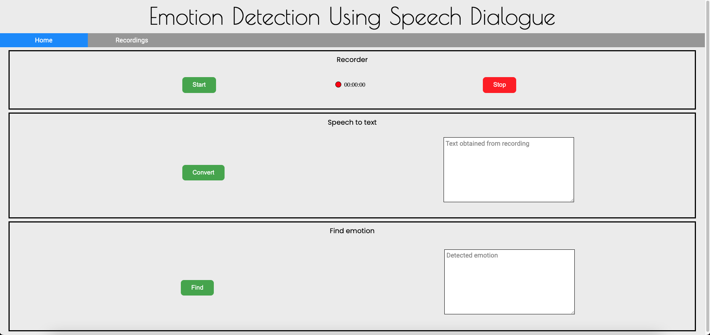
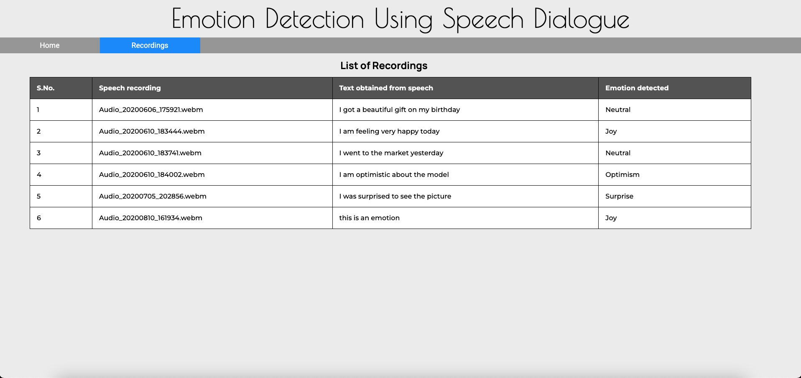

# Emotion Detection Using Speech Dialogue

## Table of contents

- [Emotion Detection Using Speech Dialogue](#emotion-detection-using-speech-dialogue)
  - [Table of contents](#table-of-contents)
  - [About](#about)
    - [Overview](#overview)
    - [Key features](#key-features)
  - [Working](#working)
  - [Development](#development)
    - [Setup](#setup)

## About

### Overview

This project is a web application which takes a speech dialogue as an input in the form of spoken audio by the user to predict an emotion on the basis of 17 categories of emotions using combination of keyword spotting, natural language processing (NLP) and machine learning (ML). <br />

### Key features

- **Django** framework is used to implement the web based **GUI** since the framework is based on **Python** it is
suitable for implementing **machine learning algorithms**.
- For the **database**, **MySQL** is used to store the speech recording in the form of spoken audio and other details required for the application.
- **IBM Watson Speech to Text API** is used to convert the speech recording to text.
- The generated text is preprocessed using the **NLP** techniques.
- The preprocessed text is then passed to the trained **machine learning model** for predicting the **emotion** for the text and displaying it to the user in the **GUI** of the web application.
- **17 categories of emotion** have been used to classify the predicted emotion.

## Working

- The front end of the project is divided into two webpages - **Home** and **Recordings**. The **Home** webpage is further divided into three sections **Recorder**, **Speech to Text** and **Find Emotion**. The **Home** webpage is used to pass input data to the back-end server for processing and displaying the response sent back by the server. The **Recordings** webpage is used to only display the information fetched from the database in the form of a table. Back-end server is used to get the data from front-end, then process it inside different Python functions designated for different tasks, then store the results in the MySQL database and then return the response back to be displayed via the **GUI**.
- **Recorder** section is used to record the spoken audio by **capturing the audio stream** from the microphone in the **WebM audio format** when the user clicks on the **start** button. When the user clicks on the **stop** button then the recording is stopped and gets passed to its designated **Python function** in the **Django back-end server** which saves the recording’s name and the spoken audio in two separate columns in the **MySQL database**.
- In the **Speech to Text** section when the **convert** button is clicked by the user then the current name of the recording is passed using the **POST request** to its designated **Python function** in the back-end server to fetch that recording from the database. The acquired recording is then handled by the **IBM Watson Speech to Text API** to convert the spoken audio in the recording to a **textual transcript**. The API is based on **deep learning technologies**. A limit of 20 words has been put on the number of words which can be present in the text generated from speech to increase the efficiency of detecting the emotion. The API returns the response in **JSON format** from which relevant data is extracted and converted to string in the same **Python function** and then passed to front-end to be displayed and also it is stored in the database for further processing to detect the emotion.
- In the **Find Emotion** section when the user clicks on the **find** button then once again the current name of the recording is passed to its designated **Python function** in the back-end server using the **POST request** to extract the text associated to that recording from the database. The acquired text then goes through the **NLP preprocessing** steps like **making all the letters lowercase**, **removing punctuation and symbols**, **removing stop words** using **NLTK corpus**, **performing lemmatization** and **correcting letter repetitions**. After preprocessing, in the **feature extraction** step **count vector parameters are extracted** from the text using the **CountVectorizer function** from the **scikit-learn library**. The idea here is to transform the text into an array with count of each word’s appearances. Then the **Random Forest Classifier** model is used to predict the emotion for the result obtained from the feature extraction step and then it is passed to the front-end for displaying the emotion to the user and also it is stored in the database for future reference.
- In the **training of the machine learning models**, the same preprocessing steps as above were performed on the data extracted from **CrowdFlower emotion dataset**. Then the target emotion labels i.e., **aggression**, **anger**, **anticipation**, **awe**, **contempt**, **disapproval**, **disgust**, **fear**, **joy**, **love**, **neutral**, **optimism**, **remorse**, **sadness**, **submission**, **surprise** and **trust** were encoded using the **label encoder**. And then the same feature extraction step as above was performed on the **independent variable column i.e., sentences**. The encoding and feature extraction steps are necessary since **machine learning models are mathematical models** and can only work on numerical data. **3 machine learning algorithms** were trained on the data extracted from the emotion dataset. The algorithms which were used are **SVC (Support Vector Classification)**, **Random Forest Classifier** and **Multinomial Naïve Bayes**.

<br />
<br />

## Development

### Setup

1) First ensure that your machine have Python >= 3.8.1 and pip >= 19.2.3.<br />

   ```
   python3 --version
   ```
   ```
   pip3 --version
   ```

2) Create a virtual environment for the project.<br />
   For conda in Anaconda:

   ```
   conda create --name <env-name>
   ```

   For venv in Python:

   ```
   python3 -m venv /path/to/new/virtual/environment
   ```
 
   Replace _\<env-name>_ with the desired name for your virtual environment and _/path/to/new/virtual/environment_ with the desired path for your virtual environment.<br /> 
   Instead of using _venv_ tool in Python to create and manage a virtual environment, any other alternative can also be used like _pipenv_, _virtualenv_, _virtualenvwrapper_, etc.<br />

3) Clone the project's repository.<br />

   ```
   git clone https://github.com/RajatYadav01/emotion-detection-using-speech-dialogue.git
   ```

4) Go to the project folder using the CLI.<br />

   ```
   cd emotion-detection-using-speech-dialogue
   ```

5) Activate the created virtual environment.<br />
   For conda in Anaconda:

   ```
   conda activate <env-name>
   ```

   For venv in Python:
   ```
   source /path/to/new/virtual/environment/bin/activate
   ```

6) Install all the packages in the activated virtual environment using the _requirements.txt_ file.<br />

   ```
   pip install -r requirements.txt
   ```

7) Inside the project directory either create a file with the name _.env_ or rename the file with the name _.env.example_ to _.env_ and intialise all environment variables given in that file with appropriate values.<br />
   For example, to generate a secret key for the project run the following commands inside the activated virtual environment:

   ```
   from django.core.management.utils import get_random_secret_key
   ```

   ```
   get_random_secret_key()
   ```

   Copy the generated secret key and paste it in front of the _SECRET_KEY_ variable in _.env_ file.

8) Finally run the following command inside the project directory to run the project and then open the generated server URL in the browser to view the running project.<br />

   ```
   python manage.py runserver
   ```

**NOTE**: When not working with the project, deactivate the virtual environment.<br />
   For conda in Anaconda:<br />

   ```
   conda deactivate
   ```

   For venv in Python:
   ```
   source deactivate
   ```
